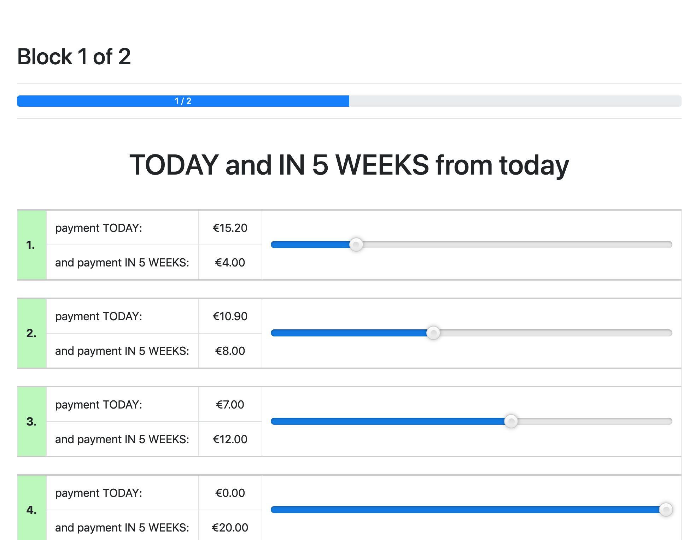

# otime - Time Preferences for otree

*otime* allows you to easily create time preference based experiments for [otree](http://www.otree.org) by editing a single configuration file (see [`config.py`](./config.py)).

## Screenshots

Here is a screenshot of time with in total two blocks configured. The configuration options match the default ones as outlined below. 


The following screenshot shows the same configuration with `VISUALIZE_CHOICES_AS_SLIDER` set to `True`.



## Configuration
Configuration is done by editing the options present in [`config.py`](./config.py).

```python
TOTAL_BUDGET = 20
``` 
This allows you to specify how much the overall budget is that can be distributed in each choice.

```python
RANDOMIZE_BLOCKS = False
```
When set to `True` the `BLOCKS` configured afterwards will not be displayed in the order entered inside the configuration file but in a random order. The output will still be saved as if the blocks were displayed *not randomized*.

```python
VISUALIZE_CHOICES_AS_SLIDER = False
```
Setting this variable to affects how the choices of a question in a block can be selected. When `False` (default) then the player will be faced with several radio buttons to do the selection. When `True`, a slider will be displayed allowing a more intuitive type of selection.

```python
BLOCKS = [
    Block(
        interest_rates=[1.05, 1.10, 1.15, 1.20],
        initial_payout_delay=0,
        initial_to_last_payout_delay=35,
        number_of_intermediate_choices=4
    ),
    ... # more Blocks
]
```
`BLOCKS` specifies the list of overall blocks the app will display. Per block there are multiple options which can be configured:

- `interest_rates`: These are the values that define how many questions the user will have to fill out during the experiment. The single values correspond to the total interest rate applied to the `TOTAL_BUDGET`, i.e. a value of `1.10` corresponds to a question where the most amount of money sooner is equal to `TOTAL_BUDGET / 1.10`. The order of values given will match the questions generated.
- `initial_payout_delay`: The number of *weeks* between *today* and the initial payout. If `initial_payout_delay = 0` then the initial payout is *today*.
- `initial_to_last_payout_delay`: The number of *weeks* between the *initial payout* and the *last payout*. As such the *last payout* is in `initial_payout_delay + initial_to_last_payout_delay` *weeks* total.
- `number_of_intermediate_choices`: The number of choices between the two fixed edge choices. The two fixed edge choices are `[Sooner: TOTAL_BUDGET / interest_rate, Later: 0]` and `[Sooner: 0, Later: TOTAL_BUDGET]`.

## Output
The output of the app is stored per `Player` in the player's `block_answers` field. The field content is a string that equals a two-dimensional JSON array, as in the following example:

```
[
  [2, 5, 7, 8], // Block 1
  [1, 3, 6, 6, 7] // Block 2
]
```

Each element in the outer array corresponds to the choices made by the player in the respective block, i.e. the first array element represents the choices the player made in Block 1 - here: `[2, 5, 7, 8]`. The single numbers of those choice arrays correspond to the selection per question as made by the player - here: `2` as first element means that the player selected the second choice in the first question which was using the first element of the block's `interest_rate` values.

The order of elements is always irrelevant of any randomization, i.e. even if `RANDOMIZE_BLOCKS` was set to `True` the output matches the order as per the `BLOCKS` in the configuration file. The order in which those blocks were displayed during the experiment to the player is stored in the subsession's `block_order` field.
